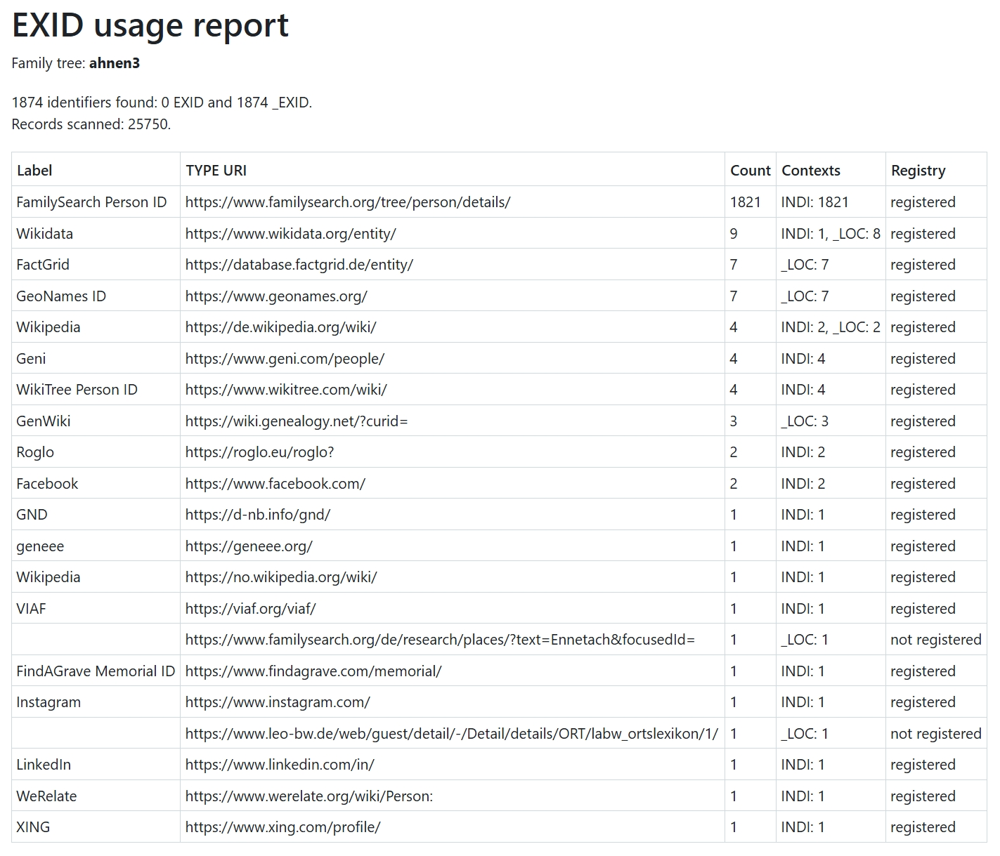

# **webtrees** module: EXID usage report

`hh_exid_report` is a [webtrees](https://www.webtrees.net) module that provides
a report of GEDCOM 7 `EXID` and legacy `_EXID` values used in a family tree.

## 📚 Contents

* [Purpose](#purpose)
* [Main features](#main-features)
* [Usage](#usage)
* [Documentation](#documentation)
* [Privacy](#privacy)
* [Requirements](#requirements)
* [Installation](#installation)
* [Screenshot](#screenshot)
* [Translation](#translation)
* [Credits](#credits)
* [License](#license)

## 🎯 Purpose

The report helps administrators and editors understand which external
identifier authorities are actually used in a selected webtrees family tree.
It is useful for reviewing the use of `EXID` and `_EXID`, checking TYPE URIs,
and identifying places where the optional [hh_exid](https://github.com/hartenthaler/hh_exid)
catalogue can provide a human-readable authority label.

## ⚙️ Main features

* scans one selected family tree;
* counts `EXID` and `_EXID` separately and shows both totals in the report
  header;
* groups identifiers by their child `TYPE` URI;
* shows the occurrence count and GEDCOM contexts;
* optionally uses the public catalogue of the `hh_exid` module to show labels
  and registration status;
* all report columns are sortable;
* works without `hh_exid`, in which case catalogue status is shown as unknown.

Identifier values themselves are not displayed.

## 🛠️ Usage

Open the report from the webtrees **Reports** menu and review the resulting table.

## 📖 Documentation

* [Installation details](docs/installation.md)
* [Issue tracker](https://github.com/hartenthaler/hh_exid_report/issues)
* [Releases](https://github.com/hartenthaler/hh_exid_report/releases)

## 🔒 Privacy

The report reads GEDCOM data already stored in the selected webtrees database.
It sends no data to external services.

## 📌 Requirements

* webtrees 2.2.x or 2.3.x; the module is webtrees 2.3 ready;
* the PHP version supported by the installed webtrees release;
* access to at least one family tree;
* the optional [`hh_exid`](https://github.com/hartenthaler/hh_exid) module for
  catalogue labels and registration status.

## 📥 Installation

### Custom Module Manager (CMM)

Install the module with [Custom Module Manager](https://github.com/Jefferson49/CustomModuleManager):

1. Open **Control panel / Modules / Custom Module Manager** in webtrees.
2. Find **EXID usage report** and click **Install module**.

### Manual installation

1. Download the [latest release](https://github.com/hartenthaler/hh_exid_report/releases/latest).
2. Extract it into the `modules_v4` directory of your webtrees installation.
3. Ensure that the directory is named `hh_exid_report`.
4. In the webtrees control panel, enable **EXID usage report**.

The module loads the shared `hartenthaler/hh-shared` library through its
autoloader. Details for developers and administrators who build the
module themselves are described in [Installation details](docs/installation.md).

## 🖼️ Screenshot

The report lists the external-identifier TYPE URIs found in the selected family
tree, including their occurrence counts and GEDCOM contexts.

## 🌐 Translation

The module uses the standard webtrees gettext system (`.po`/`.mo`) for its
user interface. Module-specific strings are maintained in
`resources/lang/default.pot` and language catalogues such as
`resources/lang/de.po`/`de.mo`. The module supports the translation APIs of
webtrees 2.2 and 2.3. Common webtrees strings such as “Family tree”, “Label”,
and “Count” are reused from the core catalogue instead of being duplicated.

### Contributions

Translation improvements are welcome as pull requests. See the repository's
issue tracker for current translation tasks.

## 🙏 Credits

* The [webtrees project](https://www.webtrees.net) for the genealogy platform
  and its extensible module architecture.
* The maintainers of the GEDCOM standard and the webtrees community for their
  work on interoperable genealogical data.

## ⚖️ License

This module is licensed under [GPL-3.0-or-later](https://www.gnu.org/licenses/gpl-3.0.html).
